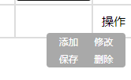

# js 显示隐藏切换

[TOC]

#### 1 场景

按钮默认是不显示的，当鼠标移动到文字上，显示按钮。点击其他位置，使按钮隐藏。



#### 2 程序

隐藏事件绑定到所在的表格上，显示事件绑定文字（即“操作”）上

```html
<table id="tb" onclick="hideOptBtns()" >  
...
<div id="change-div" onmouseover="showOptBtns(this)"> 操作 </div>
    <div id="outer-div" class="outer-div" style="display: none">
    <div id="btn-div">
        <button id="add-btn" type="button" onclick="addRow(this)"> 添加 </button>
        <button id="upd-btn" type="button" onclick="updateRow(this)"> 修改 </button>
        <button id="sbt-btn" type="button" onclick="saveRow(this)"> 保存 </button>
        <button id="del-btn" type="button" onclick="deleteRow(this)"> 删除 </button>
    </div>
</div>
```

```js
// 控制操作按钮显示的方法
function showOptBtns(obj) {
    obj.nextElementSibling.style.display = "block";
}

// 控制操作按钮隐藏的方法，在表格的范围内任意的点击
function hideOptBtns() {
    let outerDiv = document.getElementsByClassName("outer-div");
    for (let i = 0; i < outerDiv.length; i++) {
        outerDiv[i].style.display = "none";
    }
}
```