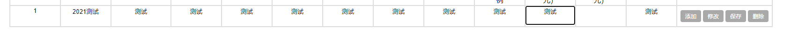

# 使用 js 发送 post 请求

[TOC]

#### 1 场景

点击表格一行对应的保存按钮，发送数据到 views 保存数据。



这里使用 django 框架。

#### 2 程序

按钮html

```html
<td>
	<button id="sbt-btn" type="button" onclick="saveRow(this)"> 保存 </button>
</td>
```

js事件操作

```js
function saveRow(obj) {
    var row = obj.parentElement.parentElement;
    var data = row.getElementsByTagName("textarea");
    
    $.post("/saverow/",
        {
			"id": data[0].value,
			"name": data[1].value,
			"age": data[2].value
        },
        function () {
            console.log("保存成功");
            window.location.reload();
        });

}
```

views 里保存

```python
@csrf_exempt
def save_row(request):
    if request.POST:
        content = request.POST.dict()
        test = save_data_helper(content)
        test.save()

    return HttpResponse("OK")

```

post 方法解释：[https://www.runoob.com/jquery/ajax-post.html](https://www.runoob.com/jquery/ajax-post.html)