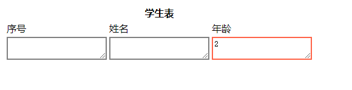

# 使用 js 对表格的列进行权限控制

[TOC]

#### 1 场景

对于 html 中的表格，有的列只能部门 A 填写，有的列只能部门 B 填写，不能填写没有权限的列。

#### 2 程序

表格html

```html
<table id="tb">
    <th id="tbname-th" colspan="14">学生表</th>
    <tr> 
        <td>序号</td>
        <td>姓名</td>
        <td>年龄</td>
    </tr>
    <tr>
        <td>
            <textarea id="id" name="id"></textarea>
        </td>
        <td>
            <textarea id="name" name="name"></textarea>
        </td>
        <td>
            <textarea id="age" name="age"></textarea>
        </td>
    </tr>
</table>   
```

利用对 textarea 标签的 readonly 属性设置

```js
// 能填写是红框，不能填写是灰框
// 如果是部门 A 登录，只能填第 name 列，不能填 age 列
// 如果是部门 B 登录，只能填第 age 列，不能填 name 列
window.onload = function(){
	var groupName = "B";
    var data = document.getElementsByTagName("textarea");
    for(var i=0,len=data.length;i<len;i++) {

		if (groupName === "A" && i === 1) {
			data[i].readOnly = false;
			data[i].style.border = "2px solid Tomato";
        }else if(groupName === "B" && i === 2){
			data[i].readOnly = false;
			data[i].style.border = "2px solid Tomato";
		}else{
			data[i].readOnly = true;
			data[i].style.border="2px solid grey";
		}
                
	}
}
```

图如下




textarea 标签的详细解释：[http://www.sz-seo.org/w3cschool/tags/tag_textarea.html](http://www.sz-seo.org/w3cschool/tags/tag_textarea.html)

【TODO: disabled 属性实现】