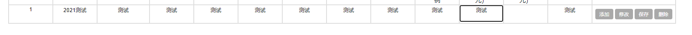

# 使用 js 对表格进行增删改

[TOC]

#### 1 场景

点击表格一行对应的操作按钮，执行相关操作。涉及数据库操作。



#### 2 程序

按钮html

```html
<td>
	<button id="add-btn" type="button" onclick="addRow(this)"> 添加 </button>
	<button id="upd-btn" type="button" onclick="updateRow(this)"> 修改 </button>
	<button id="sbt-btn" type="button" onclick="saveRow(this)"> 保存 </button>
	<button id="del-btn" type="button" onclick="deleteRow(this)"> 删除 </button>
</td>
```

js事件操作

```js
// 在指定行的下面添加一行
// 在单元格填写完后，点击“保存”按钮，将数据保存到数据库
function addRow(obj) {
	var row = obj.parentElement.parentElement;
 	var table = obj.parentElement.parentElement.parentElement;
	var newTr = table.insertRow(row.rowIndex+1);

  	var newTd0 = newTr.insertCell();
	var newTd1 = newTr.insertCell();
	var newTd2 = newTr.insertCell();
	var newTd3 = newTr.insertCell();

	newTd0.innerHTML = '<textarea id="id" name="id"></textarea>';
    newTd1.innerHTML = '<textarea id="name" name="name"></textarea>';
    newTd2.innerHTML = '<textarea id="age" name="age"></textarea>';
    newTd3.innerHTML = ' <button id="add-btn" type="button" onclick="addRow(this)"> 添加 </button>\n' +
                '<button id="upd-btn" type="button" onclick="updateRow(this)"> 修改 </button>\n' +
                '<button id="sbt-btn" type="button" onclick="saveRow(this)"> 保存 </button>\n' +
                '<button id="del-btn" type="button" onclick="deleteRow(this)"> 删除 </button>';
}
```

```js
// 删除当前行
// 在 views 里执行数据库删除操作
function deleteRow(obj) {　
    if(window.confirm("是否确定删除此条数据？")){
        row = obj.parentElement.parentElement;
        data = row.getElementsByTagName("textarea");
        $.post("/deleterow/",
            {
                "id": data[0].value,
             },
        	function () {
        		alert("删除成功");
        		window.location.reload();
         	});
	}	
}
```

```js
// 修改当前行
// 在单元格填写完后，点击“保存”按钮，将数据保存到数据库
function updateRow(obj){　
    var row = obj.parentElement.parentElement;
    var data = row.getElementsByTagName("textarea");

    for(var i=1,len=data.length;i<len;i++) {
    	data[i].readOnly=false;
    	data[i].style.border="2px solid Tomato";
    }
}
```

参考：[https://www.cnblogs.com/lyggqm/p/5681169.html](https://www.cnblogs.com/lyggqm/p/5681169.html)