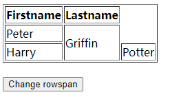

# 使用 rowSpan 和 colSpan 属性


**在使用 rowSpan 和 colSpan 属性时需要注意的一点是：设置横跨的行数或列数后，被横跨的单元格会被挤到旁边**

例如：

原始表格：


设置后：




这在将页面表格导出 EXCEL 时会出现问题，即 EXCEL 会按照图示的形式显示。


若使用 `jquery.table2excel.js` 导出，可以先给被横跨的单元格添加 `className = "noExl"`，然后在导出时添加参数 `exclude: ".noExl"`。

```js

tb.rows[tr + i].cells[td].className = "noExl";

$("#export-btn").click(function() {
	$("#tb").table2excel({
	exclude: ".noExl",
	name: "Sheet1",
	filename: "表",
	exclude_img: true,
	exclude_links: true,
	exclude_inputs: true,
	preserveColors: true
	});
});
```

----------------------------------

rowspan: [https://www.w3school.com.cn/jsref/prop_tabledata_rowspan.asp](https://www.w3school.com.cn/jsref/prop_tabledata_rowspan.asp)

colSpan: [https://www.w3school.com.cn/jsref/prop_tabledata_colspan.asp](https://www.w3school.com.cn/jsref/prop_tabledata_colspan.asp)