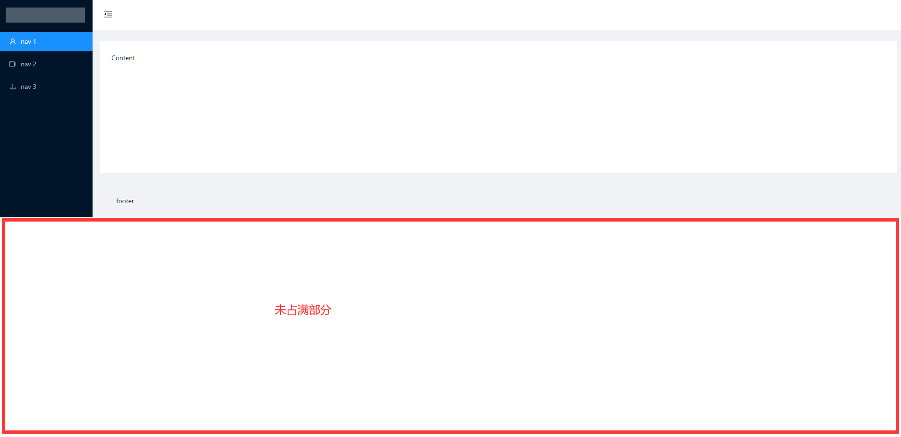
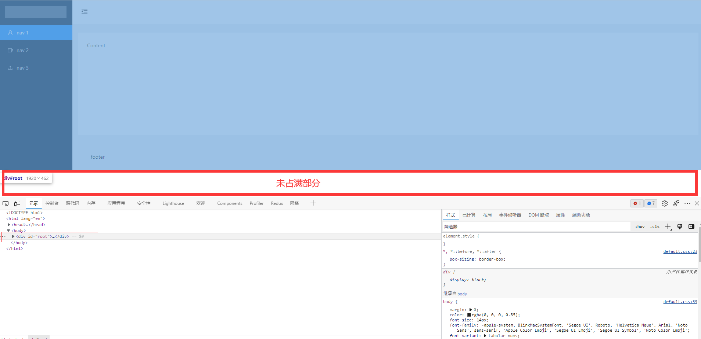
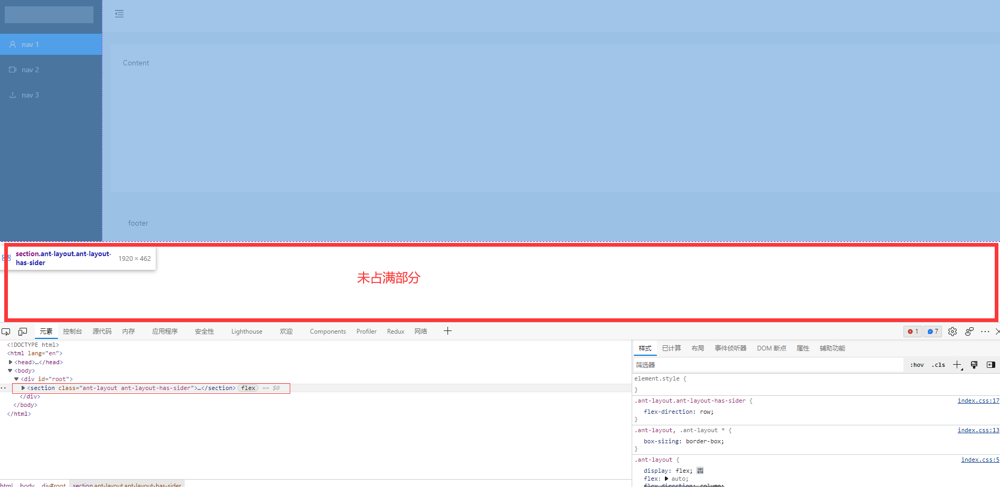
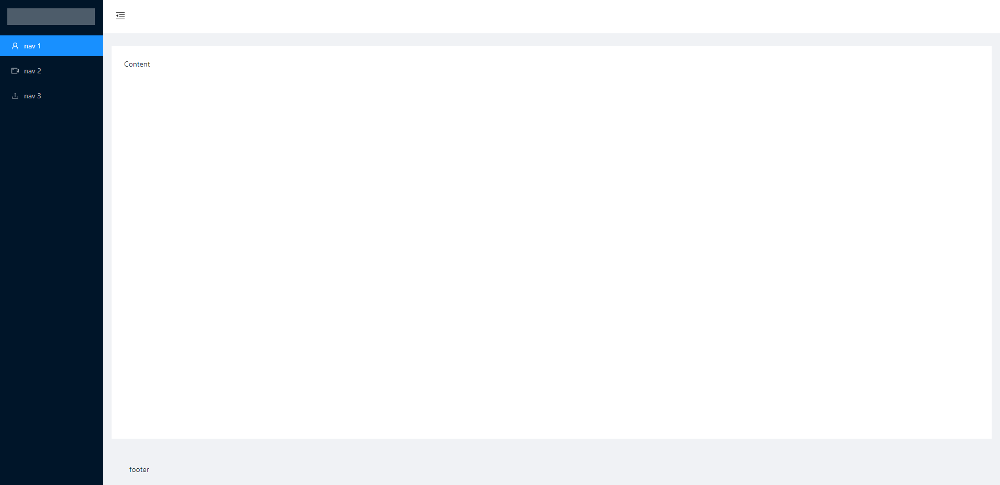

# 问题汇总

[TOC]

## 问题1: 使用antd布局的示例不能占满整个屏幕

如图所示



在浏览器调试发现，是根 div root 的问题




所以，在 index.css 文件中添加样式

```
#root {
    height: 100%;
}
```

添加了上述样式后，还是没有占满，再次调试发现是 layout 的问题



所以，在 App.css 文件中添加样式

```
.ant-layout{
    min-height: 100%;
}
```

这样就可以了


