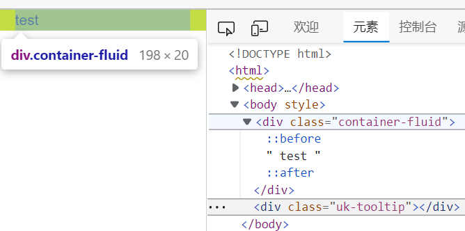
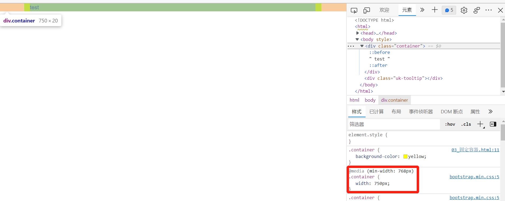
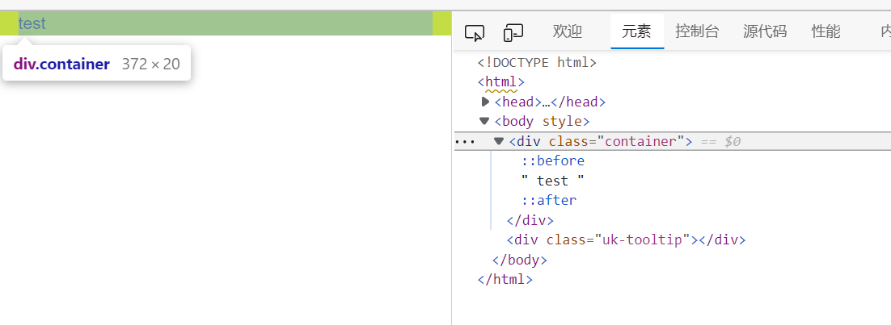

### 容器

[TOC]

#### 1 流体容器  

	width: auto

width为auto 与 width为100% 的区别：

[https://blog.csdn.net/fy_java1995/article/details/109514011?utm_medium=distribute.pc_relevant.none-task-blog-2~default~baidujs_baidulandingword~default-0.pc_relevant_paycolumn_v3&spm=1001.2101.3001.4242.1&utm_relevant_index=3](https://blog.csdn.net/fy_java1995/article/details/109514011?utm_medium=distribute.pc_relevant.none-task-blog-2~default~baidujs_baidulandingword~default-0.pc_relevant_paycolumn_v3&spm=1001.2101.3001.4242.1&utm_relevant_index=3)

#### 2 固定容器
				
阈值 | width
---|:---
大于等于1200(lg 大屏pc)   |1170（1140+槽宽）
大于等于992，小于1200(md 中屏pc) | 970（940+槽宽）
大于等于768，小于992(sm 平板)	 | 750（720+槽宽）
小于768(xs 移动手机)	|auto

#### 3 栅格系统

12个格

##### 3.1 栅格源码分析

1.流体容器&固定容器 公共样式

	  margin-right: auto;
	  margin-left: auto;
	  padding-left:  15px;
	  padding-right: 15px;	
	
2.固定容器 特定样式

	顺序不可变
    @media (min-width: @screen-sm-min) {
		width: @container-sm;
	}
	@media (min-width: @screen-md-min) {
		width: @container-md;
	}
	@media (min-width: @screen-lg-min) {
		width: @container-lg;
	}
	
3.行

	margin-left:  -15px;
	margin-right: -15px;
  	
4.列
	
	.make-grid-columns()--->
		.col-xs-1, .col-sm-1, .col-md-1, .col-lg-1,
	    .col-xs-2, .col-sm-2, .col-md-2, .col-lg-2,
	    ...
	    .col-xs-12, .col-sm-12, .col-md-12, .col-lg-12{
	        position: relative;
	        min-height: 1px;
	        padding-left: 15px;
	        padding-right: 15px;
	    }
	    
		.make-grid(xs)--->
			  float-grid-columns(@class);
					 * .col-xs-1,.col-xs-2,.col-xs-3,.col-xs-4,...col-xs-12{
					 *     float: left;
					 * }
			  .loop-grid-columns(@grid-columns, @class, width);
			  		 * .col-xs-12{
					 *     width:12/12;
					 * }
					 * .col-xs-11{
					 *     width:11/12;
					 * }
					 * ...
					 * .col-xs-1{
					 *     width:1/12;
					 * } 
			  .loop-grid-columns(@grid-columns, @class, pull);
			  .loop-grid-columns(@grid-columns, @class, push);
			  		 *push                  pull:
					 * .col-xs-push-12{         .col-xs-pull-12{      
					 *     left:12/12;              right:12/12;
					 * }                        }
					 * .col-xs-push-11{
					 *     left:11/12;
					 * }
					 * ...                      ...
					 * .col-xs-push-1{
					 *     left:1/12;
					 * } 
					 * .col-xs-push-0{           .col-xs-pull-0{
					 *     left:auto;               right:auto;
					 * }                         }
					 
			  .loop-grid-columns(@grid-columns, @class, offset);

定制化：

如果想要修改源码的值，比如修改槽宽，可以新建一个 less 文件，import bootstrap.less，在这个 less 文件修改。

#### 4 响应式工具
	
		
#### 5 栅格盒模型设计的精妙之处

	容器两边具有15px的padding	、
	行    两边具有-15px的margin	
	列    两边具有15px的padding
	
	为了维护槽宽的规则，
		列两边必须得要15px的padding
	为了能使列嵌套行
		行两边必须要有-15px的margin
	为了让容器可以包裹住行
		容器两边必须要有15px的padding